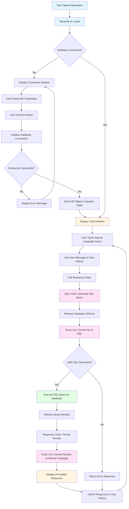

# 🤖 RAG-Chatbot-Over-SQL-Database

**Chat with Your MySQL Database Using Natural Language**

A powerful Streamlit-based chatbot that leverages Retrieval-Augmented Generation (RAG) to interact with your MySQL database using plain English. Powered by **LangChain**, **Groq's LLaMA 3.3-70B**, and **SQLAlchemy**, this application seamlessly translates natural language queries into SQL, executes them securely, and returns friendly, human-readable answers. The system intelligently interprets user questions, maintains conversation context, and dynamically generates optimized SQL queries to retrieve data from connected MySQL databases.

---

## Features

- **Natural Language Interface:** Ask questions in plain English and receive both SQL queries and human-readable responses
- **MySQL Database Support:** Compatible with any MySQL database with easy configuration through an interactive sidebar
- **Powered by Groq's LLaMA 3.3-70B:** Advanced language model providing robust, context-aware SQL query generation
- **Context-Aware Conversations:** Maintains conversation history for follow-up questions and contextual understanding
- **Read-Only Operations:** Built-in safety mechanisms ensure only SELECT queries are executed (no INSERT, UPDATE, DELETE, etc.)
- **Clean and Responsive Streamlit UI:** Intuitive chat interface for seamless database interaction
- **Real-time Query Execution:** Executes SQL queries in real-time, returning results as conversational responses
- **Schema-Aware:** Automatically retrieves and uses database schema information for accurate query generation
- **Error Handling:** Graceful error handling for invalid queries, connection issues, and edge cases

---

## Technologies Used

- **LangChain:** Framework for integrating language models with databases, enabling natural language to SQL translation
- **LangChain Community:** Additional utilities including SQLDatabase wrapper for database interactions
- **Groq's LLaMA 3.3-70B:** High-performance language model for SQL query generation and response formatting
- **SQLAlchemy:** Database toolkit and ORM for managing connections and executing SQL commands
- **MySQL Connector Python:** Native Python driver for MySQL database connectivity
- **Streamlit:** Fast, open-source web app framework for building interactive data applications
- **Python-dotenv:** Secure environment variable management
- **MySQL:** Relational database management system

---

##  Project Architecture

The project follows a modular architecture with clear separation of concerns:

1. **Frontend Layer (`frontend/ui.py`):** Streamlit-based user interface handling user interactions
2. **Configuration Layer (`config/config.py`):** Environment-based configuration management
3. **Chain Layer (`chains/`):** LangChain-based processing chains for SQL generation and response formatting
4. **Utility Layer (`utils/helpers.py`):** Database initialization and helper functions
5. **Application Entry Point (`app.py`):** Main application initialization

---

##  Project Structure

```
RAG-Chatbot-Over-SQL-Database/
│
├── app.py                      # Streamlit app entry point - initializes the chat interface
│
├── config/
│   └── config.py               # Loads database credentials from .env file and manages configuration
│
├── chains/
│   ├── sql_chain.py            # Converts user questions to SQL queries using Groq and LangChain
│   └── response_chain.py       # Maps SQL query results to human-readable answers using LLM
│
├── utils/
│   └── helpers.py              # Database connection initialization and utility functions
│
├── frontend/
│   └── ui.py                   # Streamlit UI components for chat interface and database connection
│
├── .env                        # Environment variables (database credentials and Groq API key) - NOT COMMITTED
├── requirements.txt            # Python dependencies and their versions
└── README.md                   # Comprehensive project documentation
```

### Component Details

- **`app.py`**: Main entry point that calls the UI rendering function
- **`config/config.py`**: Centralized configuration management using environment variables
- **`chains/sql_chain.py`**: Implements the SQL generation chain with strict read-only constraints
- **`chains/response_chain.py`**: Orchestrates the complete flow from query to natural language response
- **`utils/helpers.py`**: Database initialization using LangChain's SQLDatabase wrapper
- **`frontend/ui.py`**: Complete Streamlit UI with chat interface and database connection sidebar

---

##  Project Flow Chart

The following flowchart illustrates the complete workflow of the RAG-Chatbot system:



### Flow Description

1. **Initialization Phase:**
   - Application loads the Streamlit UI
   - Checks if database connection exists in session state
   - If not connected, displays connection sidebar for credentials

2. **Connection Phase:**
   - User enters database credentials (Host, Port, User, Password, Database)
   - System validates and establishes MySQL connection
   - Connection object stored in session state for reuse

3. **Query Processing Phase:**
   - User submits natural language query
   - Query added to conversation history for context
   - Response chain orchestrates the entire process

4. **SQL Generation Phase:**
   - Retrieves current database schema information
   - Passes schema, conversation history, and user question to Groq LLM
   - LLM generates read-only SQL SELECT query
   - Validates query structure

5. **Query Execution Phase:**
   - Executes generated SQL query on MySQL database
   - Retrieves raw results from database

6. **Response Generation Phase:**
   - Passes query results, schema, and context to Groq LLM
   - LLM formats raw data into natural, conversational response
   - Response displayed in chat interface
   - Conversation history updated for future context

7. **Iteration:**
   - Process repeats for each new user query
   - Conversation context maintained throughout session

---

## Demo

### Video Demonstration

Watch the demo video below to see the RAG-Chatbot in action:

https://github.com/user-attachments/assets/demo-video-url

**Or download and watch:** [Demo.mp4](./Demo.mp4)

The demo showcases:
- Setting up database connection through the sidebar
- Asking natural language questions about the database
- Viewing generated SQL queries
- Receiving human-readable responses
- Maintaining conversation context across multiple queries
- Handling various types of database queries (aggregations, filters, joins, etc.)

> **Note:** If you have a video hosted elsewhere (YouTube, Vimeo, etc.), you can replace the link above. For large video files, consider using GitHub's video hosting or external platforms to keep the repository size manageable.

---

## Installation & Setup

### Prerequisites

- Python 3.8 or higher
- MySQL Server installed and running
- Groq API key (get one from [Groq Console](https://console.groq.com/))

### Step-by-Step Setup

#### 1. Clone the Repository

```bash
git clone https://github.com/yourusername/RAG-Chatbot-Over-SQL-Database.git
cd RAG-Chatbot-Over-SQL-Database
```

#### 2. Create a Virtual Environment (Recommended)

```bash
# Create virtual environment
python -m venv venv

# Activate virtual environment
# On Windows:
venv\Scripts\activate
# On macOS/Linux:
source venv/bin/activate
```

#### 3. Install Dependencies

```bash
pip install -r requirements.txt
```

This will install:
- `streamlit` - Web framework
- `python-dotenv` - Environment variable management
- `langchain` - LangChain core framework
- `langchain-community` - Community integrations
- `langchain-groq` - Groq LLM integration
- `mysql-connector-python` - MySQL database driver

#### 4. Set Up Environment Variables

Create a `.env` file in the root directory:

```env
GROQ_API_KEY=your_groq_api_key_here
DB_HOST=localhost
DB_PORT=3306
DB_USER=root
DB_PASSWORD=yourpassword
DB_NAME=yourdatabasename
```

**Important Notes:**
- Replace all placeholder values with your actual credentials
- Never commit the `.env` file to version control
- Add `.env` to your `.gitignore` file

#### 5. Run the Application

```bash
streamlit run app.py
```

The application will automatically open in your default web browser at `http://localhost:8501`

---

## How It Works

### Detailed Workflow

#### 1. **Natural Language Query Input**
The user types a question in natural language through the Streamlit chat interface:
- "What is the total sales for this month?"
- "Show me all employees in the Marketing department"
- "How many orders were placed last week?"

#### 2. **SQL Query Generation**
The system processes the query through multiple stages:

**a) Schema Retrieval:**
- Retrieves complete database schema information
- Includes table names, column names, data types, and relationships

**b) Context Assembly:**
- Combines database schema with conversation history
- Maintains context from previous messages for follow-up questions

**c) LLM-Powered Translation:**
- Groq's LLaMA 3.3-70B model analyzes the question
- Generates optimized SQL SELECT query
- Ensures read-only operations only (security constraint)

**Example Translation:**
```
User Question: "What is the total sales for this month?"
Generated SQL: SELECT SUM(sales_amount) FROM orders 
               WHERE MONTH(order_date) = MONTH(CURDATE()) 
               AND YEAR(order_date) = YEAR(CURDATE());
```

#### 3. **Query Execution**
- SQLAlchemy executes the generated SQL query
- Connects to MySQL database using provided credentials
- Retrieves raw result set from database

#### 4. **Result Processing & Formatting**
- Raw database results passed to response generation chain
- Groq LLM formats results into natural, conversational language
- Adds context and explanations to raw numbers

**Example Output:**
```
Raw Result: [(25000.00,)]
Formatted Response: "The total sales for this month are $25,000.00."
```

#### 5. **Response Display**
- Formatted response displayed in chat interface
- Both user query and AI response stored in conversation history
- Enables contextual follow-up questions

### Conversation Context

The system maintains conversation history, allowing for:
- Follow-up questions: "What about last month?"
- Clarifications: "Show me more details"
- Refined queries: "Now filter by region"

---

## Configuration

### Database Configuration

Database settings can be configured in two ways:

#### Method 1: Environment Variables (.env file)
```env
DB_HOST=localhost
DB_PORT=3306
DB_USER=your_username
DB_PASSWORD=your_password
DB_NAME=your_database
```

#### Method 2: Streamlit Sidebar (Runtime)
- Use the sidebar input fields to change database connection
- Click "Connect" to establish new connection
- Useful for switching between databases during development

### Groq API Configuration

Set your Groq API key in the `.env` file:
```env
GROQ_API_KEY=gsk_your_api_key_here
```

**Getting a Groq API Key:**
1. Visit [Groq Console](https://console.groq.com/)
2. Sign up or log in
3. Navigate to API Keys section
4. Create a new API key
5. Copy and paste into your `.env` file

### Model Configuration

Currently using: `llama-3.3-70b-versatile`

To change the model, modify `chains/sql_chain.py` and `chains/response_chain.py`:
```python
llm = ChatGroq(model="your-preferred-model", temperature=0)
```

Available models: Check [Groq's documentation](https://console.groq.com/docs/models) for latest options.

---

## 💡 Usage Examples

### Example 1: Sales Analysis
**User:** "Show me the top 5 products by sales this year"

**Generated SQL:**
```sql
SELECT product_name, SUM(sales_amount) as total_sales
FROM sales 
WHERE YEAR(sale_date) = YEAR(CURDATE())
GROUP BY product_name
ORDER BY total_sales DESC
LIMIT 5;
```

**AI Response:** 
"The top 5 products by sales this year are:
1. Product A with $15,000 in sales
2. Product B with $12,500 in sales
3. Product C with $10,000 in sales
..."

### Example 2: Employee Query
**User:** "How many employees are in each department?"

**Generated SQL:**
```sql
SELECT department, COUNT(*) as employee_count
FROM employees
GROUP BY department;
```

**AI Response:**
"There are employees across the following departments:
- Marketing: 15 employees
- Sales: 22 employees
- Engineering: 30 employees
..."

### Example 3: Date Range Analysis
**User:** "What were the total orders placed between January and March?"

**Generated SQL:**
```sql
SELECT COUNT(*) as total_orders, SUM(order_amount) as total_revenue
FROM orders
WHERE order_date BETWEEN '2024-01-01' AND '2024-03-31';
```

**AI Response:**
"Between January and March, there were 450 orders totaling $125,000 in revenue."

---

## Security Features

### Read-Only Operations
- **Strict Query Validation:** System only generates and executes SELECT queries
- **Blocked Operations:** INSERT, UPDATE, DELETE, DROP, ALTER, TRUNCATE, and all DDL commands are prevented
- **Prompt-Level Protection:** Security constraints embedded in LLM prompts

### Credential Management
- Environment variable-based configuration
- `.env` file excluded from version control
- Password fields masked in UI

### Error Handling
- Graceful handling of SQL syntax errors
- Connection timeout management
- User-friendly error messages without exposing sensitive information

**Security Best Practices:**
- Never commit `.env` files
- Use strong database passwords
- Restrict database user permissions to read-only if possible
- Regularly rotate API keys

---

## Troubleshooting

### Common Issues and Solutions

#### Issue 1: Database Connection Failed
**Error:** "Error connecting to database"

**Solutions:**
- Verify MySQL server is running
- Check database credentials in `.env` or sidebar
- Ensure database name exists
- Verify network connectivity to database host
- Check firewall settings

#### Issue 2: Groq API Key Error
**Error:** "Invalid API key" or "Authentication failed"

**Solutions:**
- Verify API key in `.env` file is correct
- Check for extra spaces or quotes in API key
- Ensure API key is active in Groq console
- Verify API key has sufficient credits/quota

#### Issue 3: SQL Generation Errors
**Error:** "Failed to generate SQL query"

**Solutions:**
- Check database schema is accessible
- Verify table and column names exist
- Ensure question is clear and specific
- Try rephrasing the question

#### Issue 4: Module Not Found
**Error:** "ModuleNotFoundError: No module named 'xxx'"

**Solutions:**
- Ensure virtual environment is activated
- Run `pip install -r requirements.txt` again
- Check Python version compatibility (3.8+)

#### Issue 5: Streamlit Port Already in Use
**Error:** "Port 8501 is already in use"

**Solutions:**
- Use a different port: `streamlit run app.py --server.port 8502`
- Kill the process using port 8501
- Close other Streamlit instances

---

## Future Enhancements

Potential improvements and features for future versions:

- [ ] Support for multiple database types (PostgreSQL, SQLite, SQL Server)
- [ ] Query history and saved queries functionality
- [ ] Export results to CSV/JSON
- [ ] Advanced visualization of query results
- [ ] Multi-user support with authentication
- [ ] Query optimization suggestions
- [ ] Natural language explanations of SQL queries
- [ ] Support for complex JOIN operations
- [ ] Custom prompt templates
- [ ] Query validation and preview before execution
- [ ] Database schema visualization
- [ ] Performance metrics and query analytics

---

##  Contributing

Contributions are welcome! Please follow these steps:

1. Fork the repository
2. Create a feature branch (`git checkout -b feature/AmazingFeature`)
3. Commit your changes (`git commit -m 'Add some AmazingFeature'`)
4. Push to the branch (`git push origin feature/AmazingFeature`)
5. Open a Pull Request

---

## License

This project is licensed under the MIT License - see the LICENSE file for details.

---

## Acknowledgments

- **LangChain:** For providing an excellent framework for building LLM-powered applications
- **Groq:** For offering high-performance LLM inference with LLaMA 3.3-70B
- **Streamlit:** For making it easy to build beautiful web interfaces for data applications
- **SQLAlchemy:** For robust database abstraction and connection management
- **Open Source Community:** For continuous improvements and feedback

---

##  Contact & Support

For questions, issues, or contributions:
- Open an issue on GitHub
- Check existing documentation
- Review code comments for implementation details

---
